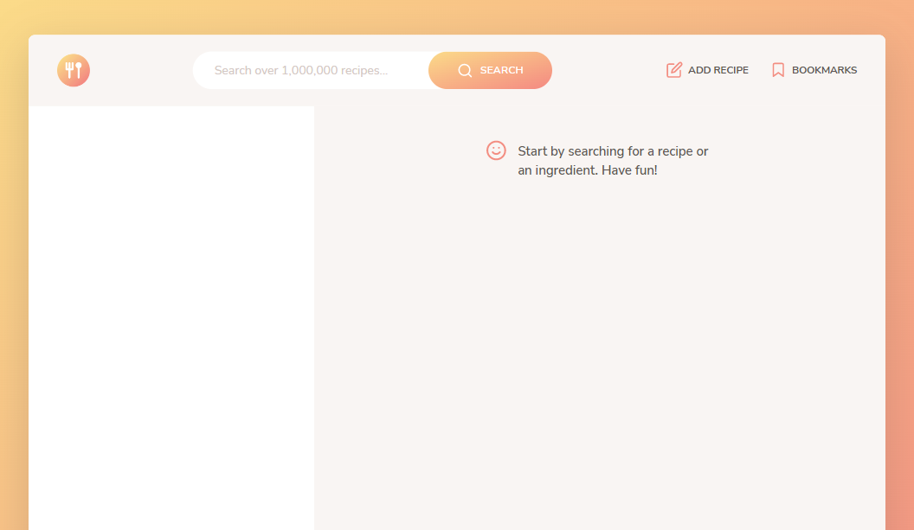
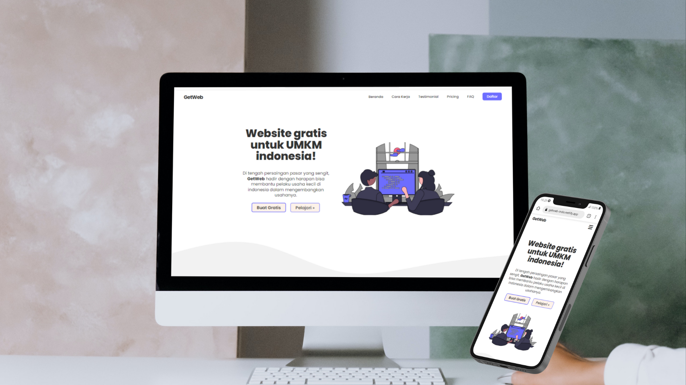

###

<h1 align= "center">
    
</h1>

###

    
  
    

###

 

    I'm Wahyu Komarudin Hidayah. I have a lot of hands-on experience in Javascript and have worked on many complex projects. I'm a stand-alone developer who finds it fun to have experimental projects for development and sharing.
    
- :raising_hand: I'm an Expert in **Frontend Development**.
- 🏆 Currently learning about Python and the latest frameworks most people used.
- 🏆 I’m looking for help from people who have the best experience in using Javascript programming.
- 📧 Email: wahyukmrsm@gmail.com

 

###

    
    
    
    
    
    
    
    
    
    
    
    
    
    
    
    
    
    

###

 

<h2 align="center">💖 Favorite projects</h2>

<table align="center">
  <tr>
    <td width="50%">
      
       
      
    </td>
    <td width="50%">
      
       
      
    </td>
  </tr>
</table>

 

###

<h2 align="center">📒 Activities</h2>

  

###

<h2 align="left">📈 Stats</h2>

  
  
  

###

 
  

    
## 💰 You can help me by Donating

    

